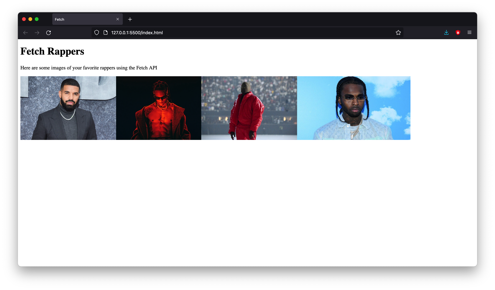

# Fetch
 This program uses the Fetch API to display images of rappers
 

I used the VSCode extension Live Server for this project, which allowed me to launch a local development server with live reload feature for static & dynamic pages.

 
 This project was created following along to this tutorial <a href="https://www.youtube.com/watch?v=tc8DU14qX6I">here</a>
